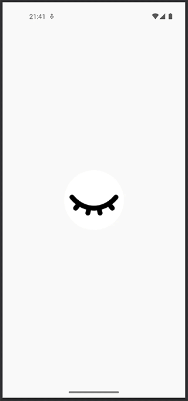

# EyeButton
Eye icon button without XML and image files

## Usage

```kotlin
val result = eyeButton(
    background = Color.LightGray,
    padding = 10.dp,
    size = 108.dp,
    rounded = 50,
    tint = Color.Black
)
```

